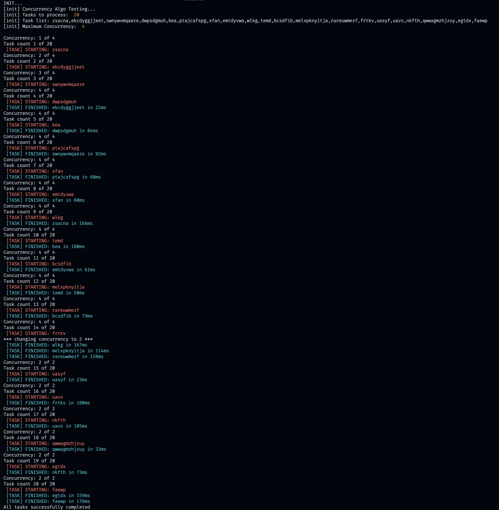

# BlueMeg Technical Assessment

This is a technical assessment from [BlueMeg](https://bluemeg.com/).

## Table of contents

-   [Overview](#overview)
    -   [The assessment](#the-assessment)
    -   [Requirements](#requirements)
    -   [Screenshot](#screenshot)
-   [My process](#my-process)
    -   [Built with](#built-with)
    -   [My approach](#my-approach)
    -   [Continued development](#continued-development)
    -   [Useful resources](#useful-resources)
-   [Author](#author)

## Overview

### The assessment

The challenge is to write a Node.js function that will process a number of tasks concurrently until the list of tasks is exhausted. There was some starter code to create a list of tasks for testing and some example output.

### Requirements

-   Promises must be resolved concurrently maintaining a maximum number in progress at any given time.
-   The concurrency level must be changeable on the fly.
-   Write clear and commented code adhering to best practices.
-   No external libraries.

### Screenshot

## My process

### Built with

-   Node.js
-   Promises
-   Callback functions
-   Concurrent Programming
-   Closures

### My approach

I maintained the starter code for the `doTask` function and the part responsible for creating the `taskList`, but I changed the function init quite a lot. I also refrained from using the `async` and `await` keywords because I didn't need for them. I found the promise syntax to be more straightforward in this case.

My primary strategy for solving this problem was calling the `manageConcurrency` function the correct number of times and passing the same function as a callback for the promises returned by `doTask`. To meet all the requirements, I created some "state variables" in a react-like fashion and controlled the behaviour of the `manageConcurrency` function with them. It was an interesting application of closures, and I also think the code is very readable.

### Continued development

Since I wasn't allowed to use external libraries and wanted to finish this assessment as soon as possible, I didn't add tests to the code. I would add some tests and make the app more robust if this code were meant for production.

### Useful resources

-   [David Flanagan - JavaScript: The Definitive Guide](https://www.oreilly.com/library/view/javascript-the-definitive/9781491952016/) - I needed a promise refresher, and, as usual, this book had everything I needed and more.
-   [Philip Roberts - What the heck is the event loop anyway?](https://www.youtube.com/watch?v=8aGhZQkoFbQ) - Great talk with an in-depth explanation of the intricate details of asynchronous programming in JavaScript.
-   [GitHub Gist - Colors reference](https://gist.github.com/abritinthebay/d80eb99b2726c83feb0d97eab95206c4) - I needed the escape code for the red colour, and I got it here.

## Author

-   Website - <https://gdsimoes.com>
-   LinkedIn - [Guilherme Dias Simoes](https://www.linkedin.com/in/gdsimoes)
